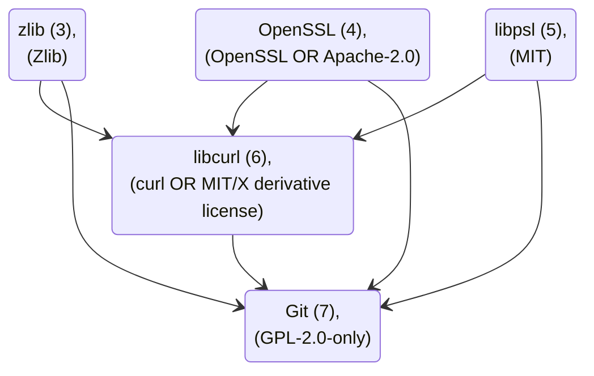

# LibCsharpStaticGitCollection

<div align="center">

  [](https://dotnet.microsoft.com/en-us/download/dotnet/8.0 "Download .NET 8.0")
  [](https://visualstudio.microsoft.com/ "Download Visual Studio")
  
  

  [](https://docs.docker.com/engine/install "Link to web page")
  [-WSL-00BCF2)](https://learn.microsoft.com/en-us/windows/wsl/install "Link to web page")

  [-Git_for_Windows-F1502F)](https://github.com/git-for-windows/git "Link to repository")
  [-zlib-2C652C)](https://zlib.net/ "Link to web page")
  [-OpenSSL-731513)](https://github.com/openssl/openssl/ "Link to repository")
  [-libpsl-394E79)](https://www.linuxfromscratch.org/blfs/view/svn/basicnet/libpsl.html "Link to web page")
  [-curl-093754)](https://curl.se/download.html "Link to web page")
  [-Git_(source_code)-F1502F)](https://git-scm.com/install/source "Link to web page")

</div>

This repository offers a convenient, cross-platform solution for using Git in a portable form for Linux and Windows. As a powerful wrapper, it abstracts the complexity of Git integration and enables quick and easy integration into existing development environments.

Integration can be done either directly via [NuGet.org](https://www.nuget.org/) or by cloning the repository. This allows the package to be used flexibly either as a direct reference or to set up your own local NuGet package feed - ideal for controlled build environments and enterprise applications.

## Example

This minimal example demonstrates how to use the package:

```c#
static void Main(string[] args)
{
    Local.ExtractArchives().Wait();

    Console.WriteLine($"Version   : {Local.GitVersion()}");
    Console.WriteLine($"Available : {Local.IsGitAvailable()}");
    var result = Chris82111.LibCsharpStaticGitCollection.Local.CallGit(
      @"clone https://github.com/Chris82111/LibCsharpStaticGitCollection.git");
}
```

## Build 

Except for the [#License](#license) and [#Acknowledgment](#acknowledgment) sections, the following sections are only relevant to developers. This applies to those who want to clone the repository and compile it themselves. They can be skipped when using NuGet.

Docker is required for the build process; WSL is also required on Windows.  
The build process takes approximately 9 minutes.

- `dotnet build /p:Configuration=Debug`
- `dotnet build /p:Configuration=Release`

There are various ways to disable individual functions during the build:

1. The file `LibraryConfigDefaults.props` can be modified, but it is tracked by Git.
2. A new file `LibraryConfigOverrides.props` can be created next to the file `LibraryConfigDefaults.props` with the following content:
   
   ```c#
   <Project>
     <PropertyGroup>
       <EnableStaticGitUseLinux>false</EnableStaticGitUseLinux>
       <EnableStaticGitUseWindows>false</EnableStaticGitUseWindows>
     </PropertyGroup>
   </Project>
   ```
   
3. An environment variable can override the properties
4. A custom property can override the properties:  
   `dotnet build -c Debug -p:EnableStaticGitUseLinux=false -p:EnableStaticGitUseWindows=false`

### Update 

The version of Git for Windows (MinGit) can be specified in the file [GitWindows.props](LibCsharpStaticGitCollection/Lib/GitWindows.props).  
The individual versions of Git for Linux can be specified in the [Dockerfile](LibCsharpStaticGitCollection/Lib/Dockerfile) file.

### Docker

The entire build process requires many prerequisites. To always provide the same build environment and avoid complications with the host operating system, the build is performed in a container. For this reason, Docker is required to create a portable Git for Linux.

#### Docker on Windows

1. See the Microsoft description: [How to install Linux on Windows with WSL](https://learn.microsoft.com/en-us/windows/wsl/install)
2. Start PowerShell in administrator mode.
3. Install WSL: `wsl --install`
4. Restart the computer
5. The installation program will start automatically, follow the descriptions
6. Open the Run dialog box with Windows key + R and enter `wsl`
7. See the Docker description: [Install Docker Engine](https://docs.docker.com/engine/install)
8. Follow the description.
9. `wsl sudo sudo usermod -aG docker $USER`
10. `wsl --shutdown`
11. Verify the installation,
    1. from inside WSL: `docker run hello-world`
    2. from cmd/PowerShell: `wsl docker run hello-world`

#### Docker on Linux

Docker must be installed on Linux.

#### Docker Errors

Here is a list of common mistakes:

1. Mounted NTFS drive:

   ```shell
   EXEC : error : failed to solve: failed to read dockerfile: open Dockerfile: no such file or directory
       LibCsharpStaticGitCollection/LibCsharpStaticGitCollection/Lib/GitLinux.targets(27,5): error MSB3073: The command "docker build --progress=plain -f LibCsharpStaticGitCollection/LibCsharpStaticGitCollection/Lib/Dockerfile -t staticgitbuildtempimage LibCsharpStaticGitCollection/LibCsharpStaticGitCollection/Lib" exited with code 1.
   ```
   
   Do not use an NTFS-mounted drive. This can cause Docker to be unable to find the `Dockerfile` file.

2. Permission denied:
   
   ```shell
   LibCsharpStaticGitCollection failed with 2 error(s) (0.1s)
       EXEC : error : permission denied while trying to connect to the Docker daemon socket at unix:///var/run/docker.sock: Head "http://%2Fvar%2Frun%2Fdocker.sock/_ping": dial unix /var/run/docker.sock: connect: permission denied
       LibCsharpStaticGitCollection/LibCsharpStaticGitCollection/Lib/GitLinux.targets(21,5): error MSB3073: The command "docker build --progress=plain -t staticgitbuildtempimage ." exited with code 1.
   ```
   
   To provoke this error, you can run `docker ps` in the terminal. An error should then appear due to insufficient permissions. This error can be resolved as follows. The current user must be added to the Docker group. Enter the following commands:
   
   1. Checks whether the group exists:  
      `getent group docker`  
      If it prints a line like `docker:x:AnyNumer:` then the group exists.  
      If it prints nothing, the group does not exist.  
   
   2. Only create a group if it does not exist; sudo is required:  
      `if ! getent group docker > /dev/null ; then sudo groupadd docker ; fi`  
   
   3. Add your user to the docker group:  
      `sudo usermod -aG docker $USER`
   
   Then log out and back in (or reboot) so the group takes effect.

## NuGet

### Create a Local NuGet Package Feed

The following commands create a local NuGet package feed named `local`:

```shell
dotnet nuget list source
```

Linux:

```shell
mkdir -p ~/.NuGetPackages
dotnet nuget add source ~/.NuGetPackages -n local
```

Windows:

```powershell
mkdir C:\NuGetPackages
dotnet nuget add source C:\NuGetPackages\ -n local
```

### Publishing Your Own Version

The following command creates a NuGet package and transfers it to a local package feed named `local`:

Change to the directory:

```powershell
cd C:\Users\Chris82111\source\repos\LibCsharpStaticGitCollection\LibCsharpStaticGitCollection
```

Change the Version in the file `LibCsharpStaticGitCollection.csproj` in the tag `Project/PropertyGroup/Version`, #Major.#Minor.#Patch.

Creating a NuGet package:

```shell
dotnet pack -c Debug -o .
```

Once you create a NuGet package it can be published:

```shell
dotnet nuget push Chris82111.LibCsharpStaticGitCollection.#Major.#Minor.#Patch.nupkg -s local
```

## License

This repository has the MIT license ([LICENSE](LICENSE) file and [SPDX](https://spdx.org/licenses/MIT.html)), but it uses many other projects, each of which has its own license that must be observed, see [THIRD_PARTY_LICENSES](THIRD_PARTY_LICENSES).  

<!-- The `LICENSE` and `THIRD_PARTY_LICENSES` files are copied to the `LibCsharpStaticGitCollection` repository published by NuGet. -->
<!-- The `README.md` file contains the same content as the NuGet description, the `Description` tag in the `LibCsharpStaticGitCollection.csproj` file. -->

More about licensing: [licensing-a-repository](https://docs.github.com/en/repositories/managing-your-repositorys-settings-and-features/customizing-your-repository/licensing-a-repository) and [SPDX-licenses](https://spdx.org/licenses/).

### License Portable Git for Linux 

- Build stage (3): Zlib ([zlib](https://zlib.net/zlib_license.html)), [SPDX](https://spdx.org/licenses/Zlib.html)
- Build stage (4): Apache-2.0 ([OpenSSL](https://github.com/openssl/openssl?tab=Apache-2.0-1-ov-file#readme)), [SPDX](https://spdx.org/licenses/OpenSSL.html)
- Build stage (5): MIT ([libpsl](https://github.com/rockdaboot/libpsl/blob/master/LICENSE)), [SPDX](https://spdx.org/licenses/MIT.html)
- Build stage (6): MIT/X derivative license ([libcurl](https://curl.se/docs/faq.html#License-Issues)), [SPDX](https://spdx.org/licenses/curl.html)
- Build stage (7): GPL-2.0-only ([Git](https://git-scm.com/about#free-and-open-source)), [SPDX](https://spdx.org/licenses/GPL-2.0-only.html)



### License Portable Windows

- Download: GPL-2.0-only ([Git for Windows](https://github.com/git-for-windows/git?tab=License-1-ov-file#readme)), [SPDX](https://spdx.org/licenses/GPL-2.0-only.html)

## Acknowledgment

- Zlib: This product includes software developed by the Zlib Project. (https://www.zlib.net/) 
- OpenSSL: This product includes software developed by the OpenSSL Project for use in the OpenSSL Toolkit (http://www.openssl.org/)
- libpsl: This product includes software developed by the libpsl Project. (https://github.com/rockdaboot/libpsl/tree/master)
- libcurl: This product includes software developed by the curl Project. (https://curl.se/)
- Git: This product includes software developed by the Git Project. (https://git-scm.com/)
